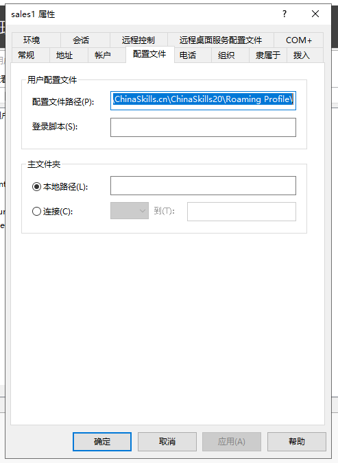

# Windows 环境题解与解析

## 一些通用项目

可以使用 `Sconfig.cmd` 实用工具对 Windows Server 快速配置

方法为，打开 `cmd` 或 `powershell`，输入 `sconfig` 即可，可以在 `sconfig` 中配置主机名，加入域，设置远程管理，网卡 IP 配置，以及禁止 Ping 等功能。

拿到新系统一定记得首先修改主机名与 IP 地址，这跟 Linux 是一样的，加入域 ( 尤其是提升域控 ) 后，修改主机名就变得麻烦了。

加入域后，可以在服务器管理器中添加主机，做统一管理，省去切换虚拟机的麻烦

加入域后，组策略都要通过 GPO 管理

需要强制更新使用 `gpupdate /force` ( 其实就是 Group Policy Update )


## DCServer

- 配置服务器的主机名，IP 地址，创建要求的用户名与密码

此题需与后面的域控制器部署结合进行

配置 IP 可在服务器管理器中直接点击网卡 IP 处快速跳转修改

使用 `ifconfig` 查看网卡 IP 配置

  

- 防火墙配置

Win+S 搜索 `高级安全 Windows Denfencer 防火墙`，入站规则中查找 `文件和打印机共享(回显请求 - ICMPv4-In)` 选择阻止连接.

  

- 安装 Zabbix-agent

正常下一步安装即可，填写服务器 IP 地址的部分如果题中没有，也没办法填写，所以暂时填一个 `127.0.0.1` 就好。

安装结束后，Win+S 搜索服务，找到 Zabbix-Agent 截图即可

  

- NIC Teaming (链路聚合)

添加网卡后，在`服务器管理器 -> 本地服务器` 找到 `NIC 组合 (NIC Teaming)` 进入，右键网卡,选择`添加到新组`，勾选成员设备，展开高级选项，成组方式选择`静态成组` (即 `IEEE 802.3ad draft v1`) ，此操作无法在虚拟机中完成，这是正常的。

  

- Active Directory Service 主域控活动目录配置工作任务

安装 AD DS 与 DNS 服务器角色，按要求正常部署域控即可，添加新的名为 ChinaSkills.cn 的 Forest

  

英文版请 `systeminfo | find “Domain”`

批量创建新用户，打开记事本，写入 4 行 for 循环脚本

```bat
for /L %%a in (1,1,100) do net user sales%%a ChinaSkills20 /add /domain
for /L %%a in (1,1,5) do net user IT%%a ChinaSkills20 /add /domain
for /L %%a in (1,1,10) do net user F%%a ChinaSkills20 /add /domain
for /L %%a in (1,1,5) do net user Manage%%a ChinaSkills20 /add /domain
```

保存为 useradd.cmd (任意文件名) 在保存位置按住 Shift 右键`在此处打开 Powershell`

执行脚本 `.\useradd.cmd`

在服务器管理器中选择 `AD DS`，右键服务器打开 `Active Directory 用户和计算机` 管理工具

进入 `Users` 组织单位，新建 4 个组，并将用户加入组

加入域后使用`组策略管理`批量修改组策略

修改域控的组策略使用默认创建的 `Default Domain Controllers Policy`，右键编辑

依次展开 `计算机配置 -> 策略 -> Windows 设置 -> 安全设置 -> 本地策略 -> 用户权限分配`

找到 `允许本地登录` ( `Allow log on locally` ),增加 `IT` 组

  

创建 `ChinaSkills20` 用户，但密码不满足复杂度要求，因此修改组策略关闭密码复杂度要求

位置为`计算机配置 -> 策略 -> Windows 设置 -> 安全设置 -> 账户策略 -> 密码策略` 将密码复杂度要求关闭

使用 `gpupdate /force` 刷新组策略

打开 `Active Directory 用户和计算机` 管理工具，添加 ChinaSkills20 用户进 `Users` 组织单位，并在 `隶属于` 选项卡中将其所属组添加 `Enterprise Admin` 与 `Domain Admins` 组，即可自动拥有 GPO 管理权限

  

- 设置漫游文件

在 `Active Directory 用户和计算机` 中，双击要修改的用户，在 `配置文件` 选项卡中，修改用户配置文件路径

  

  

当然一个一个修改是不行的

使用 Powershell 运行下列脚本即可批量修改

> Powershell 永远的神

```powershell
for($i = 1;$i -le 5;$i++)
{
    Set-ADUser Management$i -ProfilePath '\\ChinaSkills.cn\ChinaSkills20\Roaming Profile'
}
for($i = 1;$i -le 100;$i++)
{
    Set-ADUser Sales$i -ProfilePath '\\ChinaSkills.cn\ChinaSkills20\Roaming Profile'
}
for($i = 1;$i -le 5;$i++)
{
    Set-ADUser IT$i -ProfilePath '\\ChinaSkills.cn\ChinaSkills20\Roaming Profile'
}
for($i = 1;$i -le 10;$i++)
{
    Set-ADUser Finance$i -ProfilePath '\\ChinaSkills.cn\ChinaSkills20\Roaming Profile'
}

```

- 开启本地与域用户登录操作日志审计记录

对所有用户修改组策略，修改 `Default Domain Policy`

`计算机设置 -> 策略 -> Windows 设置 -> 安全设置 -> 本地策略 -> 审核策略`

开启 `审核登录时间` 与 `审核账户登录事件` ，将成功与失败都勾选。

### DHCP 服务器

正常安装 DHCP

安装后在服务器管理器右上角的旗标点开进行域授权

DHCP 新建作用域，地址范围为 `172.16.100.129` -- `172.16.100.254` ，排除 `172.16.100.129` - `172.16.100.139`,DNS 指定为 `172.16.100.201` ，WINS 指定为 `172.16.100.201`, 网关为 `172.16.100.254`

为 SDCServer 新建一个保留，MAC 地址去掉中间的 `-` 或 `:` ，IP 地址使用 `172.16.100.202`

WINS 只要安装即可，不需要额外配置

### 配置安全策略

打开 `组策略管理` 管理工具

将所有对应账户的用户在 `Active Directory 用户和计算机` 管理工具中，新建一个组织单位 `OU`，将用户与组拖入新建的对应的 OU 中。

在组策略管理中，右键组织单位，选择 `在这个域中创建 GPO 并在此处链接`,右键新建的 GPO，并选择编辑

对于 Management 用户限制仅能在 Client 上登录，在 `Active Directory 用户和计算机` 中，找到账户，双击打开属性，在 `账户` 选项卡中，打开 `登录到` 并添加计算机名。

使用 Powershell 也可 

```powershell
for ($i = 1;$i -le 5;$i++)
{
    Set-ADUser Management$i -LogonWorkstations Client
}
```

对于禁止 Finance 关机，在对应的 GPO 中，导航到 `用户配置 -> 策略 -> 管理模板 -> 开始菜单和任务栏 -> 删除并阻止访问 "关机"、"重新启动"、"睡眠" 和 "休眠" 命令`

启用该策略

  

对于证书自动注册，修改 Default Group Policy ( 默认应用于所有计算机与用户的 GPO )

修改 `计算机配置 -> 策略 -> Windows 设置 -> 安全设置 -> 公钥策略` 中的 `证书服务客户端 - 自动注册 (Certificate Services Client - Auto-Enrollment)` 以及用户配置的相同位置的相同策略，改为启用，并勾选 `续订过期证书、更新未决证书并删除吊销的证书` (`Renew expired certificates, update pending certificates, and remove revoked certificates`) 与 `更新使用证书模板的证书` (`Update certificates that use certificate templates`)

> [微软文档-配置证书自动注册](https://docs.microsoft.com/zh-cn/windows-server/networking/core-network-guide/cncg/server-certs/configure-server-certificate-autoenrollment)

  

需要配置好 AD CS 才能正常工作

对于密码策略，打开 `Active Directory 管理中心` 在本地域中找到 System 容器 (Containers)，进入后，找到 `Password Settings Container`,右键新建密码策略

  

对于 Finance，单独创建一个全部放行的密码策略，之后将密码重置为空即可

对于 Sales，新建组策略 GPO，导航至 `用户配置 -> 策略 -> Windows 设置 -> 安全设置 -> 软件限制策略`

新建策略后，进入其他规则，将 `cmd` `powershell` 与 `regedit` 限制不允许使用

### 安装并配置打印服务

安装 `打印和文件服务` 角色，安装 `打印服务器` 与 `Internet 打印`

打开 `打印管理` 实用工具，添加一个打印机，由于 ESXi 平台并不支持虚拟打印机，因此随便添加一个

添加完毕后，在打印机属性的共享处，将 `列入目录` 选中，以便将打印机发布进 Active Directory

打开 IIS 管理器，创建新网站，别名写入 `print.ChinaSkills.cn`,修改默认文档为 `ipp_0001.asp` 

在 DNS 中增加一条 CNAME 记录，别名为 `print`，记录值指向 `dcserver.ChinaSkills.cn`


## SDCserver

### 磁盘任务

在服务器管理器中，选择 `文件和存储服务`，导航到 `磁盘`，使新增加的磁盘联机，初始化磁盘并分区，如果 D 驱动器号被占用，则打开 `计算机管理`,磁盘管理中，修改光驱的驱动器号为其他值

### ISCSI

安装 `文件和存储服务` 中的 `iSCSI` 一类的所有角色项目

在服务器管理器中导航到 `iSCSI`，并单击任务，选择 `新建 iSCSI 虚拟磁盘`

  

客户端使用 `iSCSI 发起程序`

首先在 `配置` 选项卡配置反向 CHAP 密钥，之后回到 `目标` 选项卡，在 目标 中，填入 SDCserver 的主机名或 IP 地址，选择发现的目标，单击下面的连接，并打开高级选项，勾选启用 CHAP 登录，勾选 `执行相互身份验证` ，名称处使用定义的用户名，密码填写 CHAP 验证的密码即可。

  

选择 `卷和设备` 选项卡，单击自动配置即可

之后打开计算机管理中的磁盘管理像管理本地磁盘一样分区格式化即可。

### 辅助域控

安装 `AD DS` 与 `DNS` 角色，提升域控，添加入现有域，使用有权限的账户

  


在此处可配置 DNS 选项，站点使用默认即可，输入目录还原模式密码

让其通过网络从其他 DC 服务器复制域数据库即可

安装即可

查看 `systeminfo` 为备份域控制器即可

  

## Server01

### RAID 5

打开计算机管理，进入磁盘管理，右键新磁盘选择 `创建 RAID-5 卷`，按向导进行即可

### IIS + CA

先部署 CA 吧

安装 AD CS 后，这样部署即可

  

准备一个 `aspx` 我为了这个去网上学了 ASP.NET 入门之后发现 `aspx` 这个 Web Form 的开发框架早就被淘汰了……

```c#
<html>
<body>
    <p>Server01!</p>
    <p><%Response.Write(DataTime.Now.ToString());%></p>
</body>
</html>
```

## GWServer

### 开启路由功能

安装 `远程访问` 角色

角色服务安装 `路由`

安装完成后，`Win+S` 搜索路由和远程访问，打开

右键单击 `GWSERVER` 选择 `配置并启用路由和远程访问`

由于只需要路由，所以选择自定义配置

  

只勾选 `LAN 路由` 即可

  

提示启动服务，启动即可。

现在只要指定其他服务器的网关为 `GWServer` 即可。